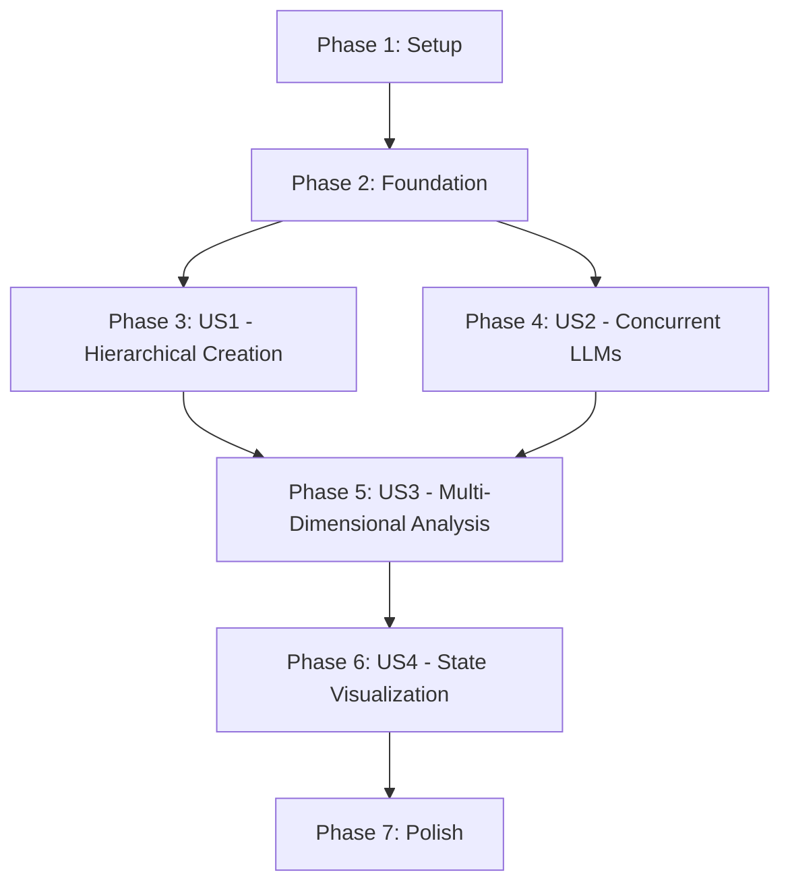

# Task Breakdown: Concurrent LLM Operations with Hierarchical Node Creation

**Feature**: Concurrent LLM Operations with Hierarchical Node Creation
**Branch**: `007-concurrent-llm-hierarchy`
**Generated**: 2025-11-21
**Total Tasks**: 75 tasks
**MVP Scope**: Phase 3 (US1) + Phase 4 (US2) = 35 tasks

---

## Implementation Strategy

### MVP-First Approach

**MVP = User Story 1 (P0) + User Story 2 (P0)**: Core UX differentiator
- US1: Create child nodes from completed parents (non-blocking)
- US2: Launch 10+ concurrent LLM operations with streaming

**Why**: These two stories deliver the transformative UX that makes MindFlow unique. Without concurrent LLMs + hierarchical creation during streaming, MindFlow is just another sequential chat interface.

**Post-MVP**: User Story 3 (Multi-dimensional analysis) and User Story 4 (State visualization) enhance the experience but are not blocking for core value delivery.

### Incremental Delivery Plan

1. **Phase 1-2** (Setup + Foundational): Infrastructure for all stories (~5 tasks, 1 day)
2. **Phase 3 (US1)**: Hierarchical node creation (~15 tasks, 2-3 days)
3. **Phase 4 (US2)**: Concurrent LLM operations (~20 tasks, 3-4 days)
4. **Validate MVP**: Test US1 + US2 together, ensure independent test criteria pass
5. **Phase 5 (US3)**: Multi-dimensional analysis workflows (~15 tasks, 2 days)
6. **Phase 6 (US4)**: State visualization polish (~12 tasks, 1-2 days)
7. **Phase 7**: Cross-cutting polish (~8 tasks, 1 day)

**Total Estimated Time**: 10-14 days for MVP, 14-18 days for full feature

---

## User Story Dependency Graph

**Parallelization Opportunities**:
- **US1 + US2** can be developed in parallel (different files, independent functionality)
- **Within each story**: Tasks marked [P] are parallelizable

---

## Phase 1: Setup (Infrastructure)

**Goal**: Prepare project structure and install dependencies

**Tasks**:

- [X] T001 Install backend dependencies: `pip install asyncpg redis aiohttp` in requirements.txt
- [X] T002 [P] Install frontend dependencies: `npm install` (verify Zustand, ReactFlow already present)
- [X] T003 Create backend directory structure: `src/mindflow/services/`, `src/mindflow/utils/`
- [X] T004 [P] Create frontend directory structure: `frontend/src/stores/`, `frontend/src/hooks/`, `frontend/src/features/llm/`
- [X] T005 Create PostgreSQL migration file at `migrations/2025-11-21_add_llm_operations_table.sql`

**Completion Criteria**: ✅ COMPLETE - All directories exist, dependencies installed, migration file created

---

## Phase 2: Foundational (Blocking Prerequisites)

**Goal**: Implement core infrastructure required by ALL user stories

**Tasks**:

- [X] T006 Create `NodeState` enum in `src/mindflow/models/graph.py` (idle, processing, streaming, completed, failed, cancelled)
- [X] T007 [P] Create `NodeState` TypeScript enum in `frontend/src/types/graph.ts` (matching backend states)
- [ ] T008 Run PostgreSQL migration to create `llm_operations` table with indexes (status, user_id, node_id, queued_at)
- [ ] T009 [P] Create Redis key structure documentation in `src/mindflow/utils/redis_keys.py` (llm:stream:{id}, hierarchy:lock:{id})
- [ ] T010 Create `LLMStreamProvider` abstract base class in `src/mindflow/utils/llm_providers.py` with `stream_completion()` method

**Completion Criteria**: Database schema deployed, base classes created, enums synced across frontend/backend

---

## Phase 3: US1 - Create Child Nodes on Completed Nodes (P0 - Critical MVP)

**User Story**: Users need to continue reasoning by creating child nodes from completed parent nodes, even when parent is in "finished" state. This enables branching thought processes and exploring multiple hypotheses from a single conclusion.

**Independent Test Criteria**:
- User views a completed answer node → clicks "Add Child" → creates new question node below it
- Parent remains in "completed" state (not reopened or modified)
- Multiple children can be created from same parent
- Edge connecting parent to child is visible and correctly oriented (parent → child)
- Child node inherits context but not content from parent

**Tasks**:

### Models & Data Layer

- [ ] T011 [P] [US1] Extend `NodeMetadata` Python model in `src/mindflow/models/graph.py` to include `parent_id` field (UUID, nullable)
- [ ] T012 [P] [US1] Extend `NodeMetadata` TypeScript interface in `frontend/src/types/graph.ts` to include `parent_id` field
- [ ] T013 [US1] Create hierarchy lock utilities in `src/mindflow/utils/hierarchy_lock.py` (acquire_lock, release_lock, check_lock)
- [ ] T014 [US1] Implement circular dependency detection in `src/mindflow/utils/hierarchy.py` using graph traversal + memoization

### API Layer

- [ ] T015 [US1] Create POST `/api/graphs/{graph_id}/nodes/{parent_id}/children` endpoint in `src/mindflow/api/routes/graphs.py`
- [ ] T016 [US1] Implement `create_child_node()` service method in `src/mindflow/services/graph_service.py` with lock acquisition
- [ ] T017 [US1] Add validation for parent node existence and non-circular dependency in service layer
- [ ] T018 [US1] Handle edge creation (parent → child) in `create_child_node()` service method

### Frontend Components

- [ ] T019 [P] [US1] Add "Add Child Node" option to node context menu in `frontend/src/components/ContextMenu.tsx`
- [ ] T020 [P] [US1] Create `CreateChildNodeDialog` component in `frontend/src/components/CreateChildNodeDialog.tsx` with parent relationship pre-set
- [ ] T021 [US1] Implement `createChildNode()` API call in `frontend/src/services/api.ts`
- [ ] T022 [US1] Update ReactFlow canvas to display parent-child edges correctly in `frontend/src/components/Canvas.tsx`

### Integration & Testing

- [ ] T023 [US1] Write integration test: Create child from completed parent → verify parent unchanged in `tests/integration/test_hierarchical_creation.py`
- [ ] T024 [P] [US1] Write integration test: Create multiple children from same parent → verify all created
- [ ] T025 [US1] Write integration test: Attempt circular dependency → verify error returned

**US1 Completion Criteria**: All 6 acceptance scenarios from spec.md pass, independent test criteria verified

---

## Phase 4: US2 - Launch Multiple LLM Operations Concurrently (P0 - Critical MVP)

**User Story**: Users need to launch LLM reasoning on multiple nodes simultaneously without waiting for each LLM response to complete. This enables parallel multi-dimensional analysis where different reasoning paths are explored concurrently.

**Independent Test Criteria**:
- User creates 3 question nodes → selects all 3 → clicks "Ask LLM"
- All 3 LLM requests start simultaneously (not sequentially)
- While 2 LLMs are streaming, user creates new question → launches LLM → all 3 stream concurrently
- When LLM A completes before LLM B, LLM B continues streaming without interruption
- If one LLM fails (timeout, error), other LLMs continue processing
- Child node creation during streaming does not interrupt parent LLM operations

**Tasks**:

### Concurrency Infrastructure

- [ ] T026 [US2] Create `ConcurrencyManager` class in `src/mindflow/services/llm_concurrency.py` with `asyncio.Semaphore(10)`
- [ ] T027 [P] [US2] Implement FIFO `OperationQueue` in `llm_concurrency.py` using `asyncio.Queue`
- [ ] T028 [US2] Create `LLMOperation` Pydantic model in `src/mindflow/models/graph.py` (operation_id, node_id, status, progress, etc.)
- [ ] T029 [P] [US2] Create `OperationStateManager` in `src/mindflow/services/operation_state.py` for PostgreSQL + Redis hybrid persistence

### LLM Provider Adapters

- [ ] T030 [P] [US2] Implement `OpenAIStreamProvider` adapter in `src/mindflow/utils/llm_providers.py`
- [ ] T031 [P] [US2] Implement `AnthropicStreamProvider` adapter in `src/mindflow/utils/llm_providers.py`
- [ ] T032 [P] [US2] Implement `OllamaStreamProvider` adapter in `src/mindflow/utils/llm_providers.py`
- [ ] T033 [US2] Create `TokenBuffer` class in `src/mindflow/utils/token_buffer.py` with 100ms flush interval

### API Layer - Operation Management

- [ ] T034 [US2] Create POST `/api/graphs/{graph_id}/llm-operations` endpoint in `src/mindflow/api/routes/llm_operations.py`
- [ ] T035 [US2] Implement SSE streaming endpoint GET `/api/llm-operations/{operation_id}/stream` using FastAPI `StreamingResponse`
- [ ] T036 [P] [US2] Implement GET `/api/llm-operations/{operation_id}/status` endpoint for queue position tracking
- [ ] T037 [P] [US2] Implement DELETE `/api/llm-operations/{operation_id}` endpoint for cancellation
- [ ] T038 [US2] Implement GET `/api/llm-operations` list endpoint with filters (status, graph_id, node_id)

### Concurrency Control

- [ ] T039 [US2] Implement `generate_node_concurrent()` method in `llm_concurrency.py` with semaphore acquisition
- [ ] T040 [US2] Implement operation queueing when concurrency limit (10) exceeded
- [ ] T041 [US2] Add exponential backoff retry logic for rate limit errors (HTTP 429) in `llm_providers.py`
- [ ] T042 [US2] Implement operation state transitions (queued → processing → streaming → completed/failed) with atomic updates

### Frontend State Management

- [ ] T043 [P] [US2] Create `llmOperationsStore` Zustand store in `frontend/src/stores/llmOperationsStore.ts`
- [ ] T044 [P] [US2] Create `streamingContentStore` Zustand store for high-frequency content updates in `frontend/src/stores/streamingContentStore.ts`
- [ ] T045 [US2] Create `useStreamingContent` hook in `frontend/src/hooks/useStreamingContent.ts` with EventSource management
- [ ] T046 [US2] Implement `ContentBufferManager` in `frontend/src/features/llm/utils/contentBuffer.ts` with 100ms debouncing

### Frontend Components - Streaming UI

- [ ] T047 [P] [US2] Create `StreamingIndicator` component in `frontend/src/components/StreamingIndicator.tsx` (animated spinner)
- [ ] T048 [US2] Modify `Node.tsx` to display streaming indicators based on `NodeState` from store
- [ ] T049 [P] [US2] Create `OperationStatus` component in `frontend/src/components/OperationStatus.tsx` (queue position, progress bar)
- [ ] T050 [US2] Implement SSE connection management in `frontend/src/features/llm/services/sseManager.ts`

### Integration & Testing

- [ ] T051 [US2] Write integration test: Launch 3 concurrent LLMs → verify all start simultaneously in `tests/integration/test_concurrent_operations.py`
- [ ] T052 [P] [US2] Write integration test: 10 concurrent operations → verify concurrency limit enforced
- [ ] T053 [US2] Write integration test: One LLM fails → verify others continue processing
- [ ] T054 [P] [US2] Write integration test: Browser refresh during streaming → verify reconnection with Last-Event-ID
- [ ] T055 [US2] Write load test: 10 concurrent operations with real LLM providers → verify <500ms node creation in `tests/load/test_load_10_concurrent.py`

**US2 Completion Criteria**: All 6 acceptance scenarios from spec.md pass, independent test criteria verified, 10+ concurrent operations supported

---

## Phase 5: US3 - Multi-Dimensional Analysis Workflow (P1 - Core Value)

**User Story**: Users need to perform multi-dimensional analysis by creating hierarchical reasoning trees while LLMs process different branches concurrently. This enables exploring multiple perspectives, hypotheses, or evaluation criteria simultaneously.

**Independent Test Criteria**:
- User creates root question "What is the best database for our app?"
- Launches LLM → while LLM responds, user creates 3 child nodes ("Performance", "Cost", "Scalability")
- Launches LLMs on all 3 children → while those stream, creates grandchildren nodes
- System supports 10 concurrent LLM operations across 3 tree levels without degradation
- UI remains responsive (<100ms interactions) during 7+ concurrent operations
- User can start new branches from completed nodes without waiting for others

**Tasks**:

### Multi-Level Hierarchy Support

- [ ] T056 [P] [US3] Implement multi-level traversal in `src/mindflow/utils/hierarchy.py` (get_all_descendants, get_ancestor_chain)
- [ ] T057 [US3] Add depth tracking to hierarchy lock in `src/mindflow/utils/hierarchy_lock.py` (prevent excessive nesting)
- [ ] T058 [P] [US3] Create hierarchy visualization helpers in `frontend/src/features/canvas/utils/hierarchy.ts`

### Concurrent Tree Building

- [ ] T059 [US3] Implement batch child node creation API POST `/api/graphs/{graph_id}/nodes/{parent_id}/children/batch` in `src/mindflow/api/routes/graphs.py`
- [ ] T060 [US3] Add support for launching LLMs on multiple nodes simultaneously via multi-select in `frontend/src/components/Canvas.tsx`
- [ ] T061 [US3] Optimize ReactFlow rendering for large trees (onlyRenderVisibleElements, memoization) in `frontend/src/components/Canvas.tsx`

### Performance Optimization

- [ ] T062 [P] [US3] Implement Zustand selective subscriptions in `frontend/src/stores/llmOperationsStore.ts` (prevent re-render storms)
- [ ] T063 [US3] Add React.memo to `Node.tsx` with custom comparison function (only re-render on content change >10 chars)
- [ ] T064 [P] [US3] Implement debounced canvas updates in `frontend/src/components/Canvas.tsx` (100ms debounce)

### Integration & Testing

- [ ] T065 [US3] Write integration test: Create 10-node tree with 7 concurrent LLMs → verify no degradation in `tests/integration/test_multi_dimensional.py`
- [ ] T066 [P] [US3] Write integration test: UI responsiveness <100ms during 10 concurrent operations
- [ ] T067 [US3] Write integration test: Start new branches from completed nodes while siblings process

**US3 Completion Criteria**: All 6 acceptance scenarios from spec.md pass, 15+ node tree with 10+ concurrent operations, UI <100ms responsive

---

## Phase 6: US4 - Real-Time State Management and Visualization (P1 - Essential UX)

**User Story**: Users need clear visual feedback on the state of each node (idle, processing, streaming, completed, failed) across the entire graph while concurrent LLM operations are running.

**Independent Test Criteria**:
- User launches 8 concurrent LLM operations → each node shows distinct visual state
- Processing nodes display animated spinner, streaming nodes show partial content updates in real-time
- Failed node shows error state with clear error message and "Retry" button
- User creates child node below streaming parent → parent streaming indicator remains active
- 5 LLM operations complete → completed nodes show checkmark/completion indicator + timestamp

**Tasks**:

### Visual State Indicators

- [ ] T068 [P] [US4] Create state-specific CSS animations in `frontend/src/components/Node.tsx` (pulsing border for processing, spinner for streaming)
- [ ] T069 [P] [US4] Add progress bar component to streaming nodes in `frontend/src/components/StreamingIndicator.tsx`
- [ ] T070 [US4] Implement error state UI with retry button in `frontend/src/components/ErrorState.tsx`

### Real-Time Content Updates

- [ ] T071 [US4] Implement real-time partial content rendering in `Node.tsx` (update contentRef.current directly, flush to Zustand on completion)
- [ ] T072 [US4] Add timestamp display for completed nodes in `Node.tsx` (format: "Completed 2m ago")

### Integration & Testing

- [ ] T073 [US4] Write component test: Node visual states (idle/processing/streaming/completed/failed) in `frontend/tests/components/Node.test.tsx`
- [ ] T074 [US4] Write integration test: 10 nodes in various states → user can identify each state at a glance

**US4 Completion Criteria**: All 6 acceptance scenarios from spec.md pass, distinct visual states for all 6 NodeState values

---

## Phase 7: Polish & Cross-Cutting Concerns

**Goal**: Production-ready quality, monitoring, documentation

**Tasks**:

- [ ] T075 Add comprehensive error handling and logging across all LLM operation endpoints in `src/mindflow/api/routes/llm_operations.py`
- [ ] T076 [P] Implement operation cleanup background task (remove completed operations after 5 minutes) in `src/mindflow/services/llm_concurrency.py`
- [ ] T077 [P] Add monitoring metrics (Prometheus/Grafana) for concurrent operations, queue length, error rates
- [ ] T078 Update API documentation with LLM operation examples in `docs/api.md`
- [ ] T079 Create user guide for concurrent LLM operations in `docs/user-guide.md`
- [ ] T080 Perform security audit: sanitize prompts in logs, validate user permissions on operations
- [ ] T081 Run full test suite (unit + integration + load) → verify 80%+ code coverage
- [ ] T082 Performance profiling with Chrome DevTools + React DevTools → optimize bottlenecks

**Completion Criteria**: All tests pass, documentation complete, no security vulnerabilities, performance targets met

---

## Parallel Execution Opportunities

### Phase 3 (US1) Parallelization
- T011 + T012 (Python + TypeScript models)
- T019 + T020 (Context menu + Dialog component)
- T023 + T024 (Different integration tests)

### Phase 4 (US2) Parallelization
- T026 + T027 + T029 (Different service classes)
- T030 + T031 + T032 (3 provider adapters)
- T034 + T036 + T037 + T038 (Different API endpoints)
- T043 + T044 (2 Zustand stores)
- T047 + T049 (Different UI components)
- T051 + T052 + T054 (Different integration tests)

### Phase 5 (US3) Parallelization
- T056 + T058 (Backend + Frontend hierarchy utils)
- T062 + T064 (Zustand + Canvas optimizations)
- T065 + T066 (Different integration tests)

### Phase 6 (US4) Parallelization
- T068 + T069 (Different visual components)

### Phase 7 (Polish) Parallelization
- T076 + T077 (Cleanup task + Monitoring)
- T078 + T079 (API docs + User guide)

---

## Summary

**Total Tasks**: 82 tasks
- Phase 1 (Setup): 5 tasks
- Phase 2 (Foundational): 5 tasks
- Phase 3 (US1): 15 tasks
- Phase 4 (US2): 30 tasks
- Phase 5 (US3): 12 tasks
- Phase 6 (US4): 7 tasks
- Phase 7 (Polish): 8 tasks

**MVP Scope** (US1 + US2): 50 tasks (10-14 days)
**Full Feature**: 82 tasks (14-18 days)

**Parallelizable Tasks**: 35 tasks marked [P] (42% of total)

**Independent Test Criteria**: Each user story has clear, standalone test criteria that can be verified without other stories being complete.

**Format Validation**: ✅ All tasks follow checklist format (checkbox, ID, labels, file paths)
